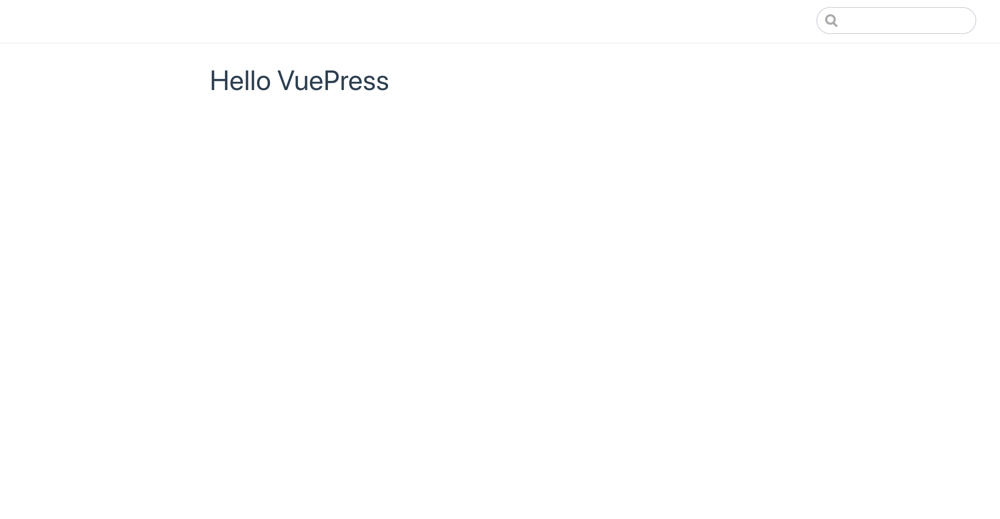
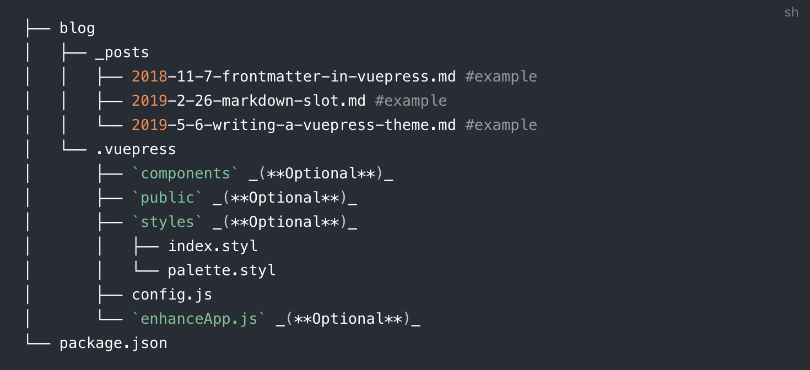
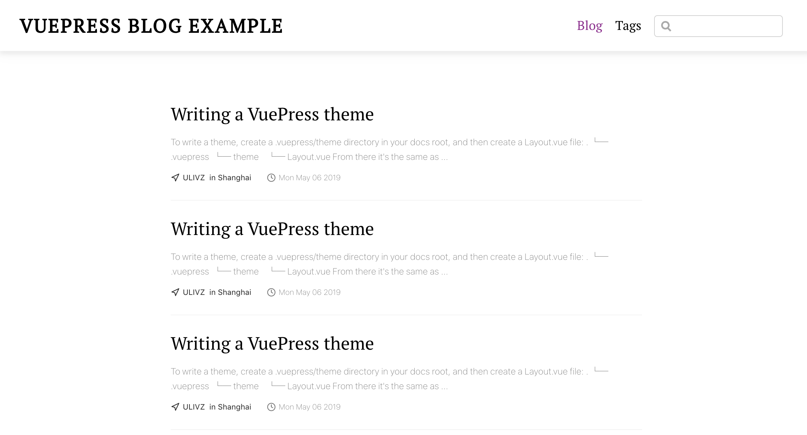

本ブログは、VuePressを使用して作成しました。  
VuePressを使用した理由ですが、最近学んだvue.jsを生かしてブログを作りたいと思ったということと、静的サイトジェネレーターに触れてみたかったからです。  

今はシンプルすぎる構成をしていますが、徐々にカスタマイズしていき、余力があれば1から自作テーマを作ることにも挑戦してみたいと思ってます。  
(もっとカスタマイズしてから公開したい気持ちもあったのですが、公開がどんどん後に延びるように思ったので、勢いで公開しました:sweat_smile:)  
  

今回VuePressに触れたので、早速VuePressの使い方について記事を書いていきます。

VuePressを始めること自体は凄く簡単で、[VuePress公式ドキュメント：Getting Started](https://vuepress.vuejs.org/guide/getting-started.html) の6つの手順踏めば、すぐにローカルで立ち上げることができます。

この手順を踏んで立ち上げ直後の画面です↓




と、上記画像を見ればわかるように、記事をすぐ公開できる状態ではありません。

なので、手軽にブログを始めたい場合はブログテーマを使用するのが良いと思います。  

上記とは別のフォルダで、[@vuepress/theme-blog：Quick Start](https://vuepress-theme-blog.ulivz.com/#quick-start) の手順を踏んでみてください。  
`yarn create vuepress [blogName]`から始まるコマンドです。


実行すると、次のようなことを聞かれますが
```
? Select the boilerplate type
```

公式ドキュメントで推奨するディレクトリ構成が次のようになっているので、`blog`と回答しました。



  

Step2の`yarn dev`を実行すれば、テストデータが入ってることもあり、ブログが完成します。




カスタマイズ方法(タイトルの変え方、フッターの変え方など)は下記サイトに書いてあるので、参考にしてみてください。  
[https://vuepress-theme-blog.ulivz.com/](https://vuepress-theme-blog.ulivz.com/)


今後補足追記など行うと思います。
