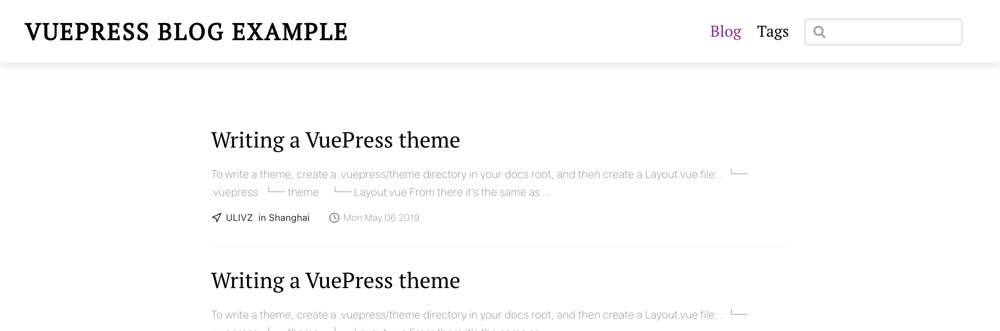
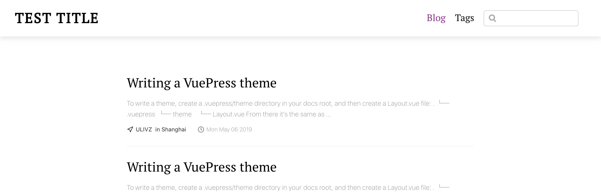
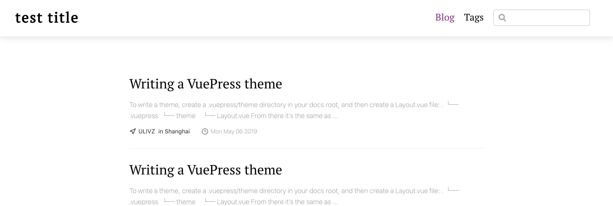

VuePressのテーマのカスタマイズ方法を紹介します。<br><br>
[前回の記事](http://localhost:8080/2020/06/17/start-vuepress/)の手順を踏むと、次のようなブログが作成できました。


<br>

ここで、タイトルを次のように `'test title'` に変更してみます。

blog/.vuepress/config.js<br>
```
module.exports = {
  title: 'test title',
  description: 'This is a blog example built by VuePress',
  theme: '@vuepress/theme-blog', // OR shortcut: @vuepress/blog
```



画像を見るとわかるように、小文字で test title と設定したのに大文字で表示されています。<br>
これを、小文字のまま表示するようにしてみたいと思います。

なぜ、大文字で表示されているのか、[今回のテーマのソースコード](https://github.com/vuepressjs/vuepress-theme-blog)を追ってみると、vuepress-theme-blog/components/Header.vue にて、`.title`に `text-transform uppercase`が適用されているからだとわかります。

この問題を解決するために、テーマ継承を行います。<br>

.vuepressディレクトリ下にtheme/index.jsファイルを作成し、次のように書いてください。
```
module.exports = (themeConfig, ctx) => {
   return {
     extend: '@vuepress/blog'
   }
}
```

次に、components/Header.vueファイルを作成し、[公式のHeader.vueのコード](https://github.com/vuepressjs/vuepress-theme-blog/blob/master/components/Header.vue)をコピペします。<br>
コピペしたら、次の2点を修正してください。
* `text-transform uppercase`を削除
* `import Feed from './Feed'`を`import Feed from '@parent-theme/components/Feed'`に変更

以上の手順を踏むと、無事タイトルが小文字で表示されるようになります。


<参考URL><br>
[https://vuepress.vuejs.org/theme/option-api.html](https://vuepress.vuejs.org/theme/option-api.html)

[https://vuepress.vuejs.org/theme/inheritance.html](https://vuepress.vuejs.org/theme/inheritance.html)


