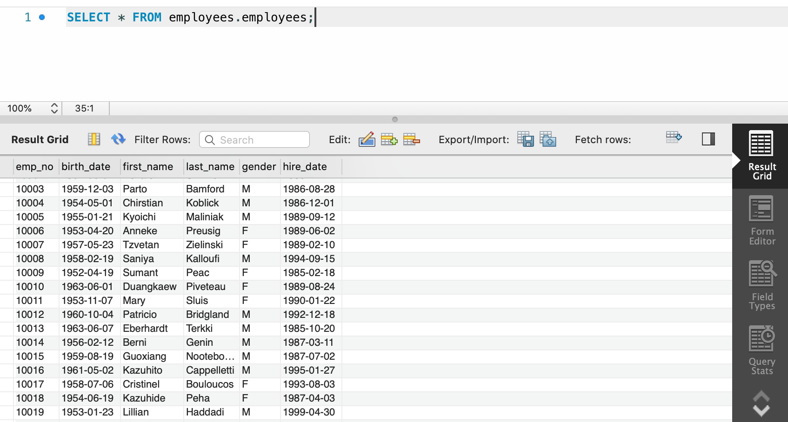
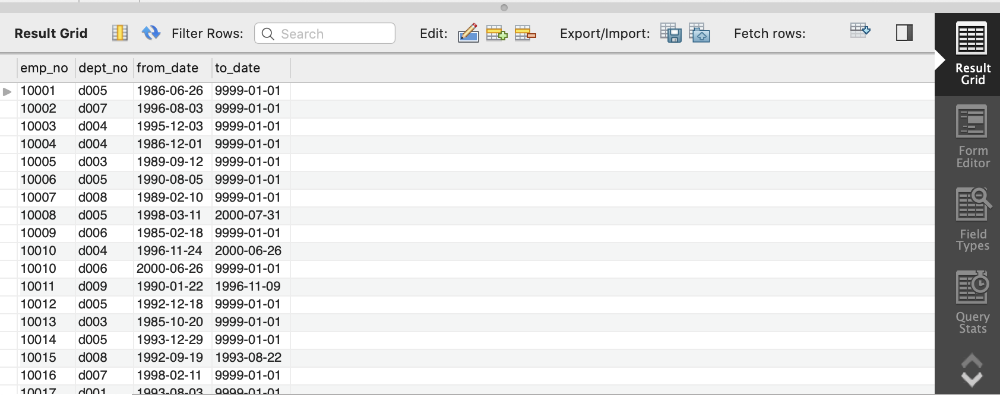
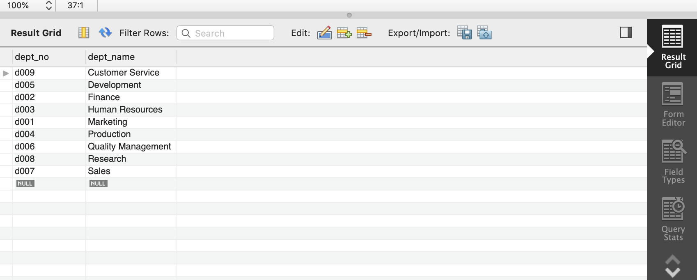
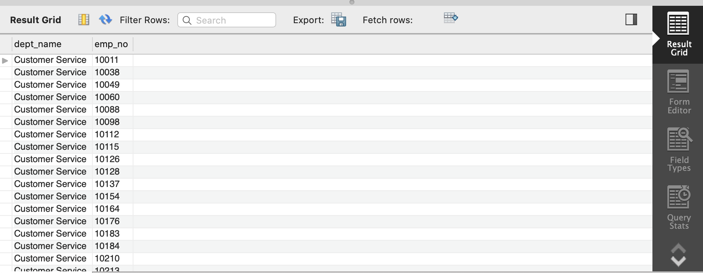
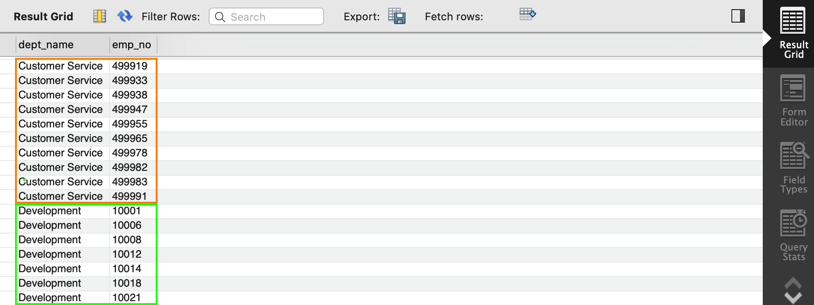
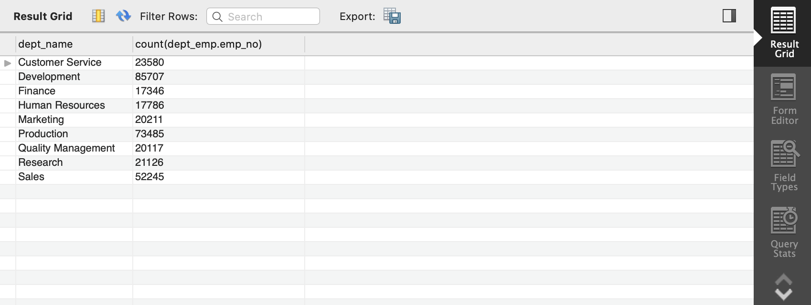
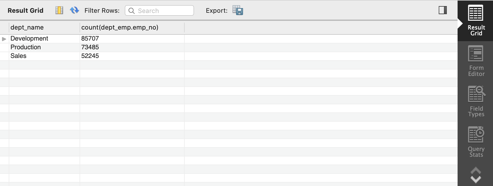

GROUP BYとHAVINGについて、簡単な例で使い方をパっと理解したかったので、記事を書きます。

# 環境作り
練習用のデータが欲しいので、MySQL公式のExample Databasesである、`employee data`をインストールします。  
[MySQL :: Other MySQL Documentation](https://dev.mysql.com/doc/index-other.html)

インストール方法は簡単で、githubよりDL・解凍し、そのフォルダに移動して

```
mysql -u root -p < employees.sql
(パスワード入力)
```
と実行するだけです。


無事インストールできたら、下記2コマンドを入力すると、
```
mysql> USE employees
mysql> show tables;
+----------------------+
| Tables_in_employees  |
+----------------------+
| current_dept_emp     |
| departments          |
| dept_emp             |
| dept_emp_latest_date |
| dept_manager         |
| employees            |
| salaries             |
| titles               |
+----------------------+
8 row in set (0.00 sec)
```

と、テーブルが表示されます。

この後はSQLを色々書いてみるのですが、MySQL Workbenchなどからデータを見ると見やすくてオススメです。




# 今回使用するテーブル

## dept_empテーブル
`emp`とは`employee`、つまり従業員  
`dept`とは`department`、つまり部署のことです。  


(全データの内の一部です)  

## departmentsテーブル


# GROUP BY

GROUP BYを使う前に、まずは上記2テーブルを結合してみます。
```
SELECT
    departments.dept_name,
    emp_no
FROM
    dept_emp
    INNER JOIN
        departments
    ON  dept_emp.dept_no = departments.dept_no;
```



(全データの内の一部です)  


ここで、部署ごとの所属してる人数を知りたいので、左側の`dept_name`が同じのを1つにまとめます。  
それは`GROUP BY departments.dept_name`で実現できます。  
下記図でいうと、オレンジ線と緑線がそれぞれ1つにまとめるイメージです。  



そしたら、`dept_name`は同じ名前ごとに1つになるので何も問題ないですが、`emp_no`はそれぞれ異なる値が1つになってしまいます。

この時、いくつの`emp_no`が1つにまとめられたのかをカウントして欲しいので、`count(dept_emp.emp_no)`とします  
(レコードの数を数えるということで`count(*)`でも良いです)

```
SELECT
    departments.dept_name,
    count(dept_emp.emp_no)
FROM
    dept_emp
    INNER JOIN
        departments
    ON  dept_emp.dept_no = departments.dept_no
GROUP BY
    departments.dept_name;
```



# HAVING

havingとはwhereと同じく条件を指定することで取得したいレコードを抽出できます。

whereとは何が違うかというと、コマンドの実行順序が違うようです。

1. WHERE
2. GROUP BY
3. HAVING

の順番で実行されるため、
* GROUP BYの前(グループ化する前)に実行したい時はWHERE
* GROUP BYの後(グループ化した後)に実行したい時はHAVING

と理解すれば良いです。

それでは、人数が50000人以上の部署を抽出しようとします。

先程の表の`count`が50000以上であれば良いので、先程のSQLに`Having count(dept_emp.emp_no) > 50000`を付け足して
```
SELECT
    departments.dept_name,
    count(dept_emp.emp_no)
FROM
    dept_emp
    INNER JOIN
        departments
    ON  dept_emp.dept_no = departments.dept_no
GROUP BY
    departments.dept_name
Having count(dept_emp.emp_no) > 50000;
```



となります。

## 参考文献
[SELECT 文の活用 (GROUP BY) - オラクル・Oracle SQL 入門](https://www.shift-the-oracle.com/sql/group-by-having.html)

